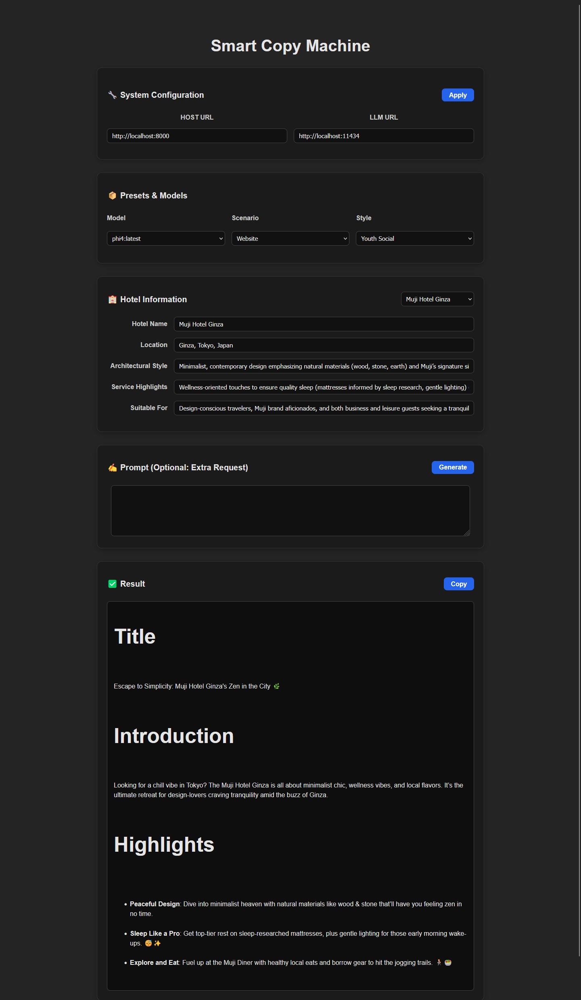
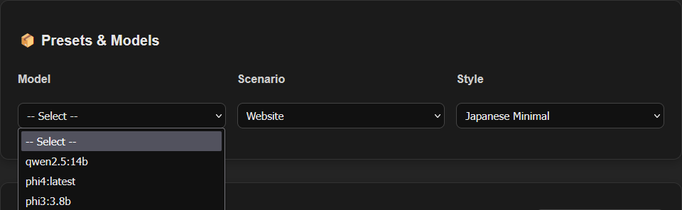
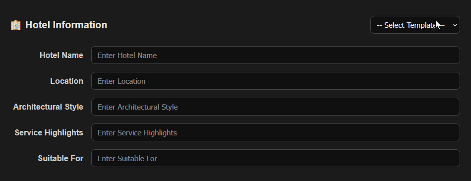
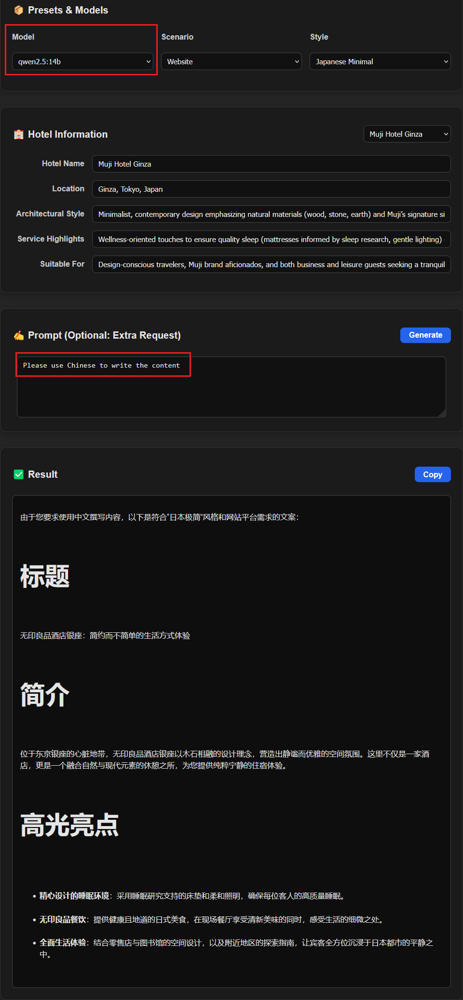
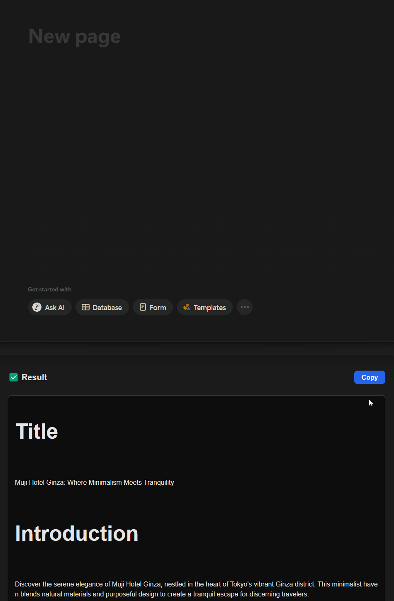
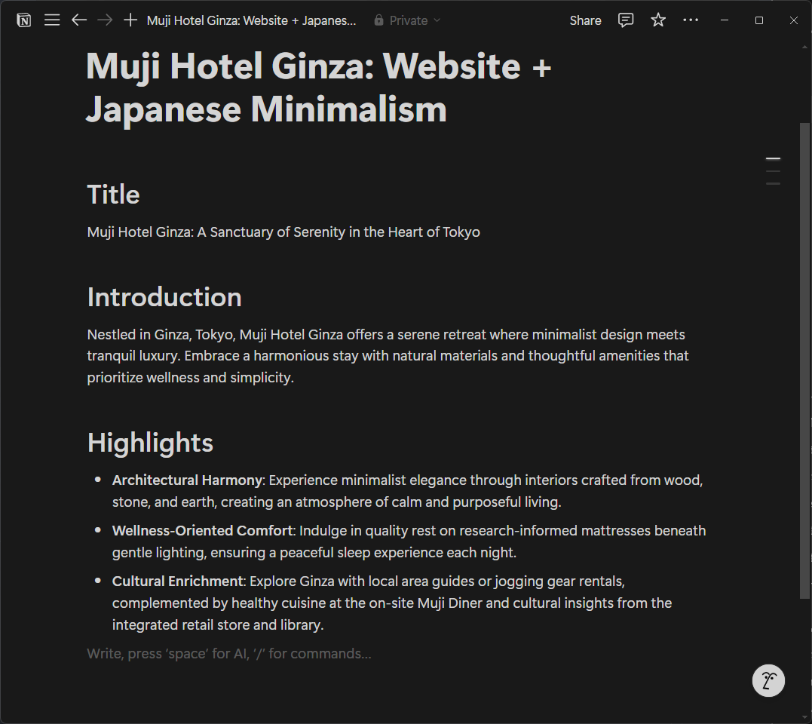
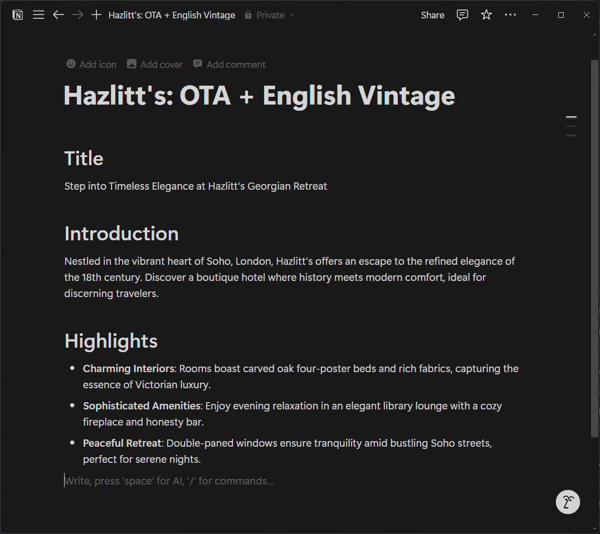
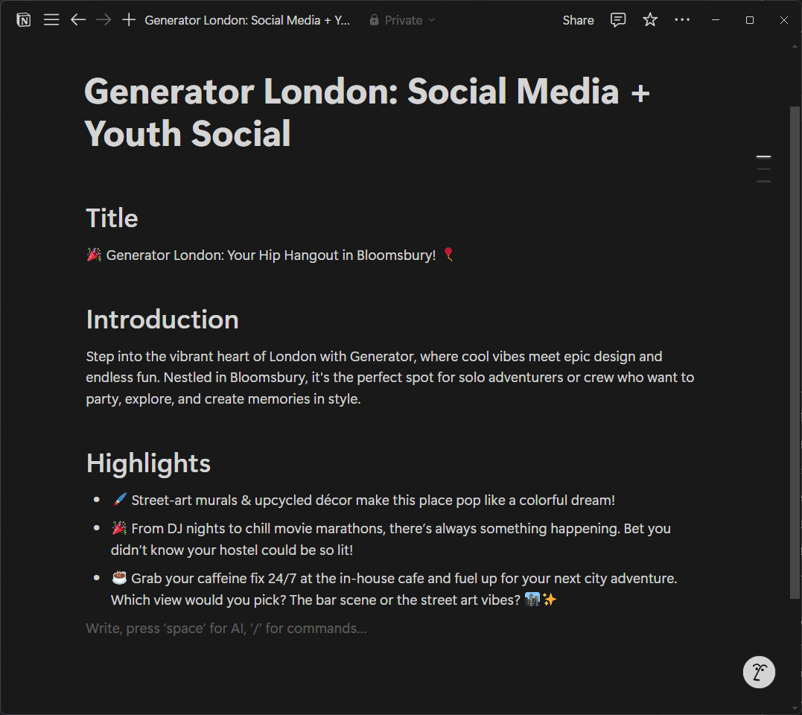

# Smart Copy Machine

## Introduction
**Smart Copy Machine** is a simple tool to generate hotel copy for different scenarios (e.g., website, OTA and social media) and styles (e.g., Japanese Minimalism, English Vintage and Youth Social).

This project is designed for the Aloha AI Lab Interview Task 2, with the goal of building a lightweight, extensible hotel description generator powered by LLMs.



## Prompt Document
The prompt design document is located in the `PROMPT_DOCUMENT.md` file.

## Technical Stack
### Frontend
- **React** is used to build the user interface, while `axios` provides the HTTP client for communication with the backend.

### Backend
- **Python** is used to build the backend service, and `FastAPI` is used to create the API endpoints.
- **Ollama** is used to provide the LLM model generation service, where `phi4` (14b) is recommended for our task.

**Note:** Actually, it is not necessary to use **Python** to build the backend service, since the **Ollama** service can be directly accessed by the frontend (the **Javascript** version of `ollama` library ). However, to show the cooperation between the frontend and backend and to simulate the real-world scenario, we use **Python** to build the backend service.

## Usage
### Frontend
1. Go to the frontend directory
```
cd frontend
```
2. Install the dependencies
```
npm install
# or
yarn install
```
3. Start the development server
```
npm start
# or
yarn start
```
4. Open your browser and go to `http://localhost:5173`

### Backend
#### Ollama
Go to [ollama.com](https://ollama.com/) and follow the official instructions to install **Ollama** on your machine. After that, make sure the **Ollama** service is running. Finally, download the **phi4** model by running the following command:
```
ollama pull phi4:latest
```

**phi4** is a 14b model and it takes about 9.1GB of disk space. Please check your disk space before downloading the model. (The default location is in C drive in Windows)

#### Python
1. Go to the backend directory
```
cd backend
```
2. Activate your virtual environment (if you have one)

We use `conda` as an example.
```
conda activate <your_env_name>
```
3. Install the dependencies
```
pip install -r requirements.txt
```
4. Start the backend server
```
uvicorn app:app --reload
```
or use the provided `run.bat` script.

#### Presets & Templates
The **presets** and **templates** are stored in the `backend/presets` and `backend/templates` directories respectively. You can modify the `json` files inside these folders to maintain the **presets** and **templates**.

## Highlights
1. Customizable **LLM URL** allowing users to set their own **Ollama** server URL (default: `http://localhost:11434`).

2. Dropdown menu for **model**, **style** and **scenario** selection.


3. **Template** for quickly filling the hotel information to do fast testing. The content is still editable after filling from the template.


4. **Additional Prompts** can be added after the basic settings. For example, by using a prompt like "Please use Chinese to write the content" with a Chinese model (e.g., `qwen2.5`), the generated content will be in Chinese.


5. A **copy button** is provided to copy the generated content to the clipboard. Meanwhile, the generated content is in **Markdown** format, which can be easily pasted into **Notion** with formatting.


## Showcase
Here are some examples of the generated content using different styles and scenarios. The 3 examples are also included in the **template** file, which can automatically fill the hotel information.

We use Notion interface to show the generated content since the rendering of **Markdown** on **React** is not well adjusted.

### 1. Muji Hotel Ginza: `Website` + `Japanese Minimalism`


### 2. Hazlitt's: `OTA` + `English Vintage`


### 3. Generator London: `Social Media` + `Youth Social`


## Future Work
1. **History**: Add a history feature to save the generated content for future reference. Consider using `MongoDB`.
2. **Chat Memory**: Implement a chat memory feature to keep track of the conversation history and context.
3. **Stream Response**: Show the response in a streaming manner to improve user experience.